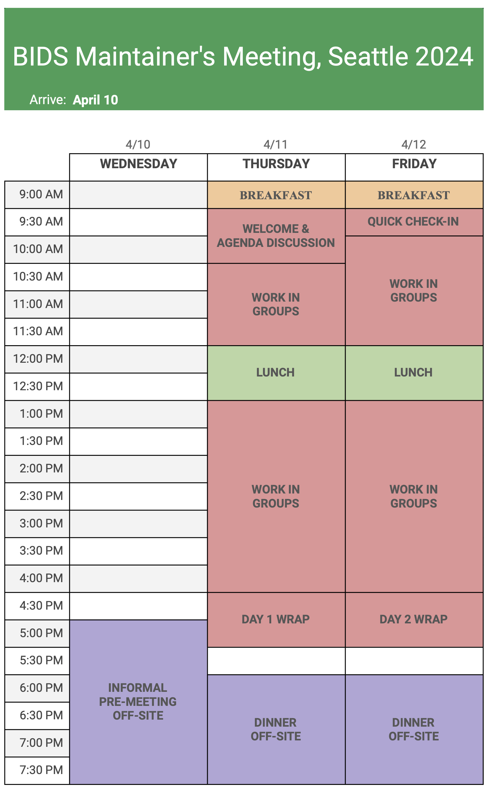

# BIDS maintainer meeting, Seattle, April 11-12, 2024

The purpose of this meeting is to broadly advance BIDS development and coordination.  
Participants will work in small groups on topics including advancing key BEPs and common priorities.

## Location

The meeting will take place at the [University of Washington eScience Institute Data Science Studio](https://www.google.com/maps/place/eScience+Institute/@47.6536832,-122.3135565,16z/data=!4m5!3m4!1s0x549014f277b0f15d:0x7c2434f079426d8c!8m2!3d47.6533665!4d-122.3117848)

*Note the venue is not open before 9am.* 

## Schedule

NOTE: All times tentative until confirmed by @arokem

An informal pre-meeting will take place **Wednesday, April 10th** as participants arrive, expected to start ~4-5pm.

## Lodging and Logistics

Details have been shared with invitees regarding funding provided for this meeting covering travel, lodging, and food.
Nearby lodging options include Staypineapple University Inn, Staypineapple Watertown, etc.

## Funding support

The workshop is supported by the NSF through the [West Big Data Innovation Hub](https://www.westbigdatahub.org/) and by the
[Neuro Irv and Helga Cooper Foundation Open Science Prize](https://www.mcgill.ca/neuro/open-science/open-science-awards-and-prizes/neuro-irv-and-helga-cooper-foundation-open-science-prizes).
